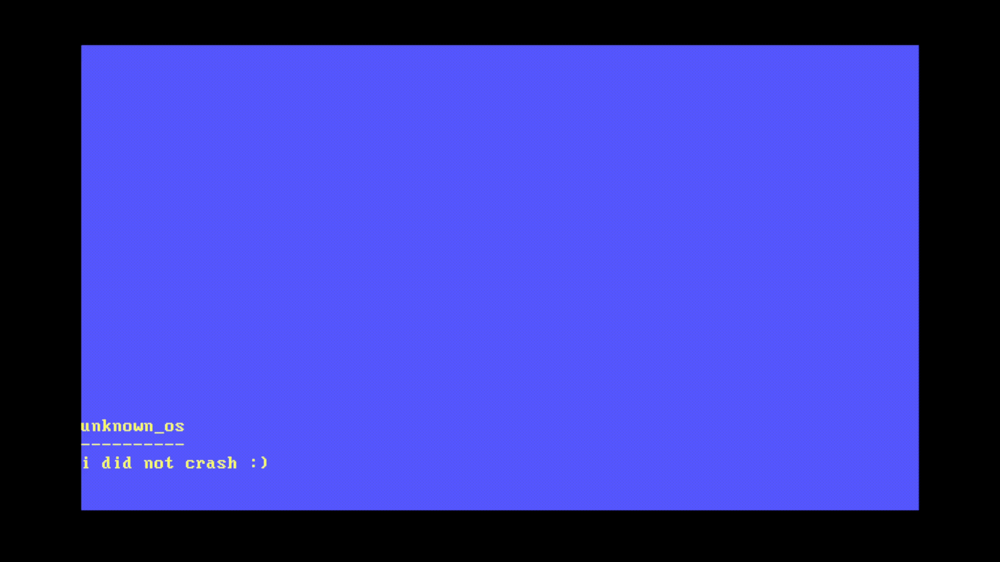

<pre align="center">
<strong>Elliot /</strong> <a href="https://elliot.science/">Homepage</a> / <a href="https://github.com/elliowo">GitHub</a> / <a href="https://matrix.to/#/@elliowo:matrix.org"> Matrix </a></pre>

Hello :) 

I am currently working as a full-stack developer. As the sole developer at family company, I oversee the all websites and infrastructure.

---

- Currently learning OS dev
- Contact me through Matrix 

---

### Some of my projects 

[unknown_os](https://github.com/elliowo/unknown_os) - A hobby operating system I am working on written in Rust, is currently a very basic kernel

[mullvad-wg-doas](https://github.com/elliowo/mullvad-wg-doas) - Fork of phvr's Mullvad VPN script, with sudo replaced with OpenDoas

---

